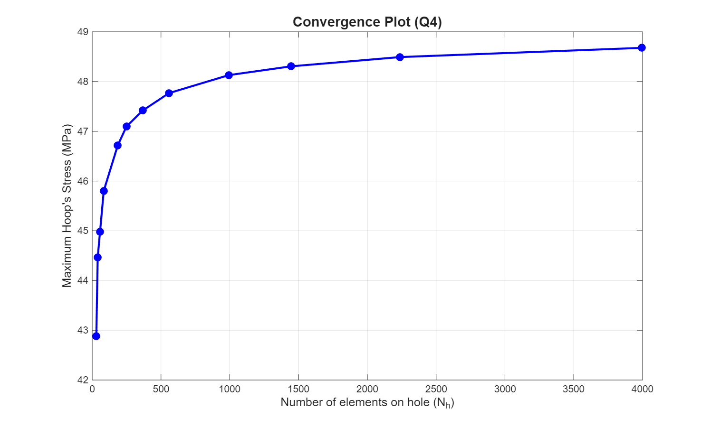
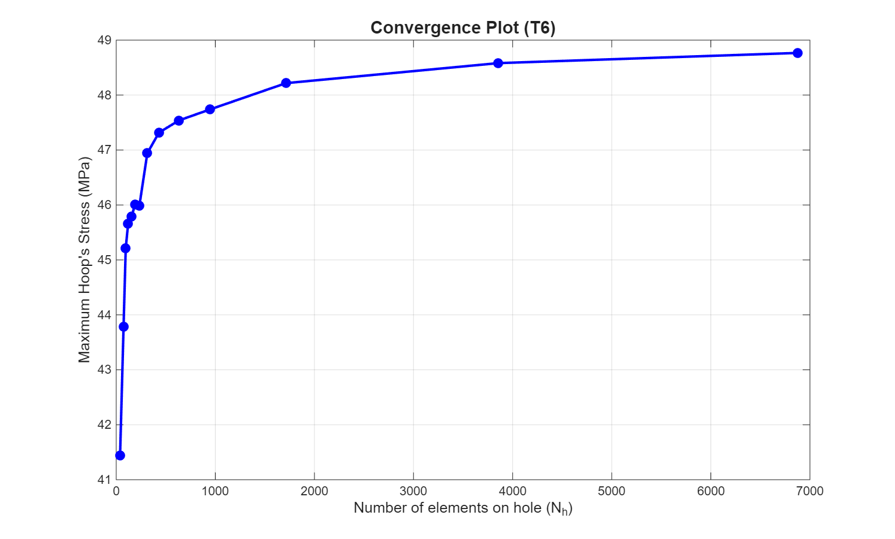
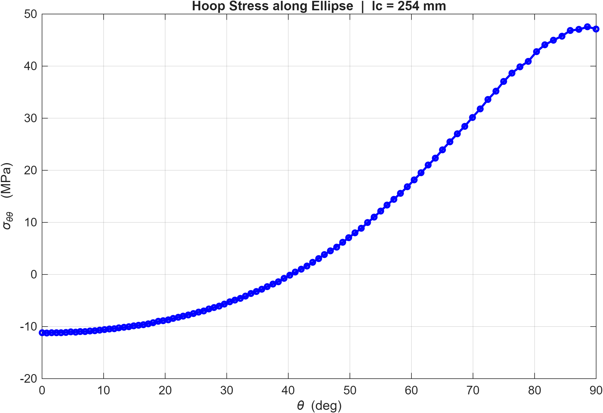
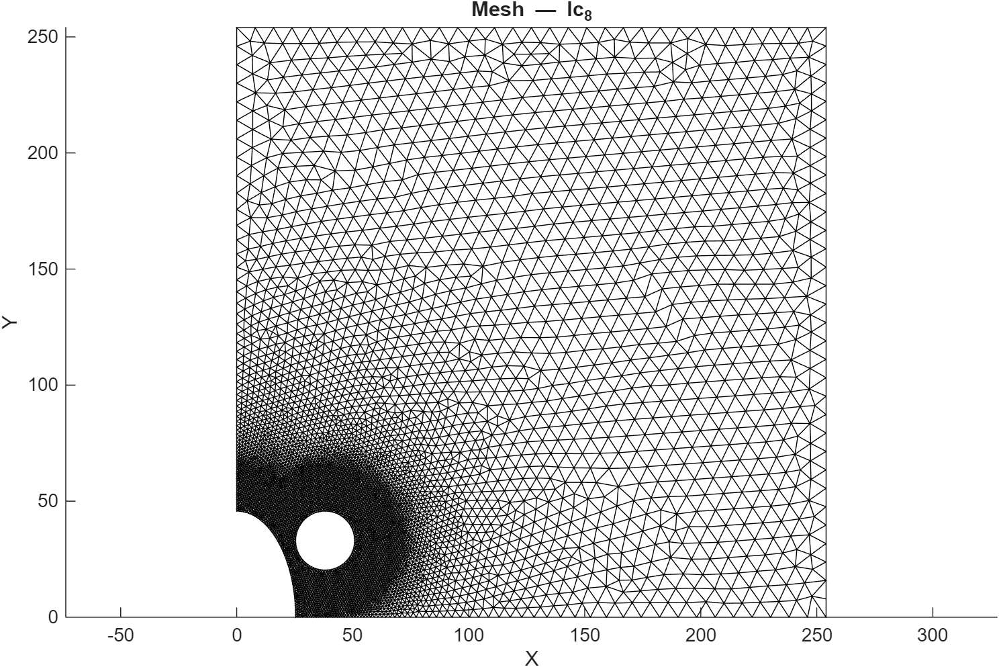
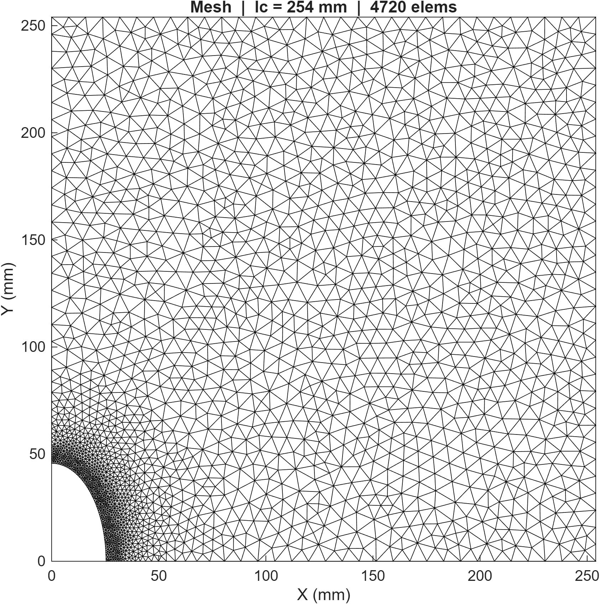
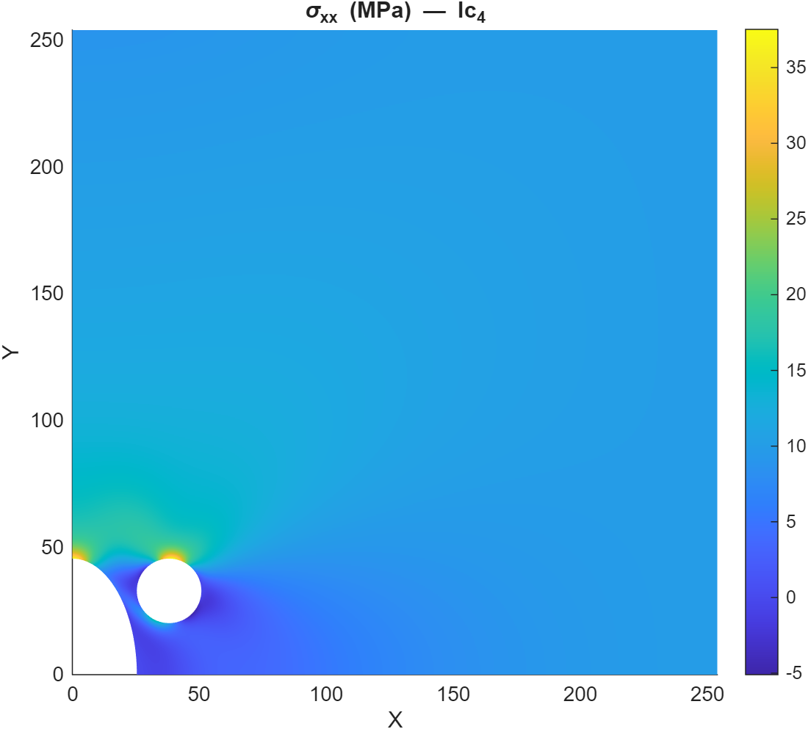
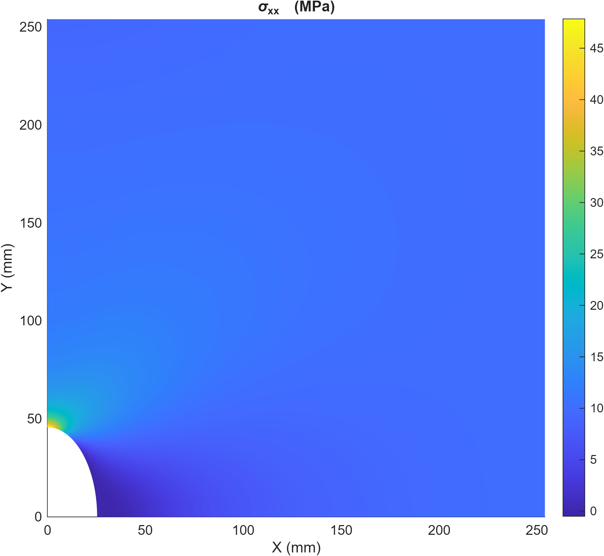

# MATLAB + Gmsh Automated FEM Pipeline for Stress Concentration Analysis

MATLAB + Gmsh based automated Finite Element Method (FEM) framework for stress concentration analysis of quarter plates containing elliptical and relief holes using Q4 and T6 elements.

---

# Project Overview

This project implements a complete computational mechanics workflow for:

- Geometry generation using Gmsh
- Automated mesh generation
- Mesh parsing into MATLAB
- Q4 and T6 FEM formulations
- Sparse global stiffness assembly
- Plane stress analysis
- Stress recovery and post-processing
- Hoop stress extraction along discontinuities
- Stress Concentration Factor (SCF) evaluation
- Mesh convergence studies
- Automated plotting and result export

The project was developed to study stress concentration behavior around:

- Elliptical holes
- Circular relief holes

under uniaxial tensile loading.

---

# Why This Project Matters

Stress concentration analysis is critical in:

- automotive structural components,
- aerospace brackets,
- pressure vessels,
- fatigue-sensitive structures,
- lightweight structural design,
- durability-focused engineering applications.

This project demonstrates how a fully automated FEM workflow can be developed from first principles for engineering design evaluation and convergence verification.

---

# Key Engineering Achievements

- Developed a fully automated MATLAB + Gmsh FEM workflow
- Implemented Q4 and T6 finite elements from scratch
- Automated mesh convergence studies
- Computed hoop stress around geometric discontinuities
- Implemented sparse stiffness matrix assembly
- Compared lower-order vs higher-order element behavior
- Automated post-processing and result export pipeline
- Performed stress redistribution studies using relief holes

---

# From-Scratch FEM Implementation

This project implements the finite element workflow from first principles, including:

- element stiffness derivation,
- numerical integration,
- Jacobian mapping,
- global matrix assembly,
- boundary condition application,
- stress recovery,
- convergence analysis.

No commercial FEM solver was used for the core implementation.

---

# Key Features

## FEM Solver Features

- Q4 (bilinear quadrilateral) element formulation
- T6 (quadratic triangular) element formulation
- Isoparametric finite elements
- Gauss integration
- Sparse stiffness matrix assembly
- Consistent traction boundary conditions
- Plane stress elasticity formulation

---

## Automation Pipeline Features

- Automatic `.geo` mesh size modification
- Automated Gmsh execution from MATLAB
- Automatic `.msh` generation
- Batch mesh convergence studies
- Automatic result extraction
- Automated Excel/CSV export
- Automatic plot generation and saving
- Case-wise organized output structure

---

## Post-Processing Features

- Displacement visualization
- Stress contour visualization
- Hoop stress extraction
- Stress concentration factor computation
- Convergence plotting
- Error analysis against analytical solution

---

# Engineering Concepts Used

This project involves several computational mechanics and numerical analysis concepts:

- Plane stress elasticity
- Finite Element Method (FEM)
- Isoparametric mapping
- Jacobian transformation
- Gauss quadrature
- Stress recovery
- Stress concentration analysis
- Mesh convergence analysis
- Sparse matrix methods
- Numerical post-processing
- Workflow automation

---

# Engineering Applications

The methods implemented in this project are relevant to:

- automotive structural design,
- stress concentration mitigation,
- lightweight structure development,
- durability analysis,
- fatigue-sensitive component design,
- computational CAE workflows.

---

# Problem Description

The project analyzes a quarter plate subjected to uniaxial tensile loading.

The geometry contains:

- A primary elliptical hole
- A circular relief hole

The objective is to:

- Evaluate stress concentration behavior
- Extract hoop stress distribution
- Compute Stress Concentration Factors (SCF)
- Compare Q4 and T6 element performance
- Perform mesh convergence studies
- Study the influence of relief hole positioning

---

# Computational Workflow

```text
Geometry (.geo)
        ↓
Automatic Gmsh meshing
        ↓
Mesh (.msh)
        ↓
Mesh parser
        ↓
Element stiffness assembly
        ↓
Global stiffness matrix
        ↓
Boundary condition application
        ↓
Linear system solution
        ↓
Stress computation
        ↓
Hoop stress extraction
        ↓
SCF evaluation
        ↓
Convergence analysis
        ↓
Export + visualization
```

---

# Repository Structure

```text
FEM-Stress-Concentration-Pipeline/
│
├── README.md
│
├── figures/
│   ├── q4_mesh_convergence.png
│   ├── t6_mesh_convergence.png
│   ├── t6_hoop_stress_without_relief_hole.png
│   ├── t6_mesh_with_relief_hole.png
│   ├── t6_mesh_without_relief_hole.png
│   ├── t6_sigma_xx_with_relief_hole.png
│   └── t6_sigma_xx_without_relief_hole.png
│
├── geometry/
│   ├── q4/
│   │   ├── with_relief_hole/
│   │   └── without_relief_hole/
│   │
│   └── t6/
│       ├── with_relief_hole/
│       └── without_relief_hole/
│
├── matlab/
│   ├── q4/
│   │   ├── with_relief_hole/
│   │   │   ├── automation/
│   │   │   ├── solver/
│   │   │   ├── visualization/
│   │   │   └── post processing/
│   │   │
│   │   └── without_relief_hole/
│   │
│   └── t6/
│       ├── with_relief_hole/
│       └── without_relief_hole/
│
├── results/
│   ├── q4_with_relief_hole/
│   ├── q4_without_relief_hole/
│   ├── t6_with_relief_hole/
│   └── t6_without_relief_hole/
│
└── report/
    └── FEM_Stress_Concentration_Report.pdf
```

---

# Technologies Used

- MATLAB
- Gmsh
- Finite Element Method (FEM)
- Computational Mechanics
- Numerical Methods
- Sparse Matrix Computation
- Scientific Computing
- Structural Analysis
- Stress Analysis
- CAE Workflow Automation

---

# Important MATLAB Components

## Solver Modules

The solver modules include:

- mesh parsing
- element stiffness computation
- stress recovery
- global stiffness assembly
- FEM equation solving
- hoop stress extraction

---

## Automation Modules

The automation pipeline performs:

- automatic mesh generation
- mesh refinement studies
- Gmsh execution from MATLAB
- result extraction
- convergence analysis
- organized result export

---

## Visualization Modules

The visualization modules generate:

- mesh plots
- stress contours
- convergence plots
- hoop stress plots

---

# Software Requirements

## MATLAB

Recommended:

- MATLAB R2023a or later

---

## Gmsh

Download:

https://gmsh.info/

The project uses:

- Gmsh 4.x

---

# How To Run The Project

## Step 1 — Install Gmsh

Install Gmsh and note the path to:

```text
gmsh.exe
```

---

## Step 2 — Open MATLAB

Open the project folder in MATLAB.

---

## Step 3 — Add Project Folders To MATLAB Path

```matlab
addpath(genpath(pwd));
```

---

## Step 4 — Configure Gmsh Path

Inside the automation script:

```matlab
cfg.gmshPath = 'C:\\Path\\To\\gmsh.exe';
```

---

## Step 5 — Run Automation Pipeline

```matlab
run_convergence_study
```

or

```matlab
main_T6_pipeline
```

---

# Sample Results

## Q4 Mesh Convergence Study

Convergence behavior of maximum hoop stress with progressive mesh refinement using Q4 elements.



---

## T6 Mesh Convergence Study

Convergence behavior of maximum hoop stress using higher-order T6 elements.



---

## T6 Hoop Stress Distribution

Hoop stress variation along the elliptical boundary.



---

## T6 Mesh — With Relief Hole

Finite element mesh generated using quadratic T6 elements around the elliptical discontinuity and circular relief hole.



---

## T6 Mesh — Without Relief Hole

Mesh distribution around the elliptical hole without stress-relief modification.



---

## T6 σxx Stress Contour — With Relief Hole

Stress redistribution around the elliptical discontinuity after introducing a circular relief hole.



---

## T6 σxx Stress Contour — Without Relief Hole

Stress concentration distribution without the relief hole configuration.



---

# Stress Concentration Analysis

## Hoop Stress

Hoop stress is extracted along:

- elliptical hole boundary
- circular relief hole boundary

---

## Stress Concentration Factor (SCF)

The apparent stress concentration factor is computed using:

```math
K_t = \frac{\sigma_{max}}{\sigma_{applied}}
```

---

# Validation

The numerical results were compared against:

- theoretical stress concentration trends,
- mesh convergence behavior,
- expected higher-order element accuracy characteristics.

The FEM predictions showed good agreement with classical analytical stress concentration behavior.

T6 elements demonstrated improved convergence and stress prediction near curved discontinuities.

---

# Q4 vs T6 Comparison

## Q4 Elements

- Bilinear interpolation
- Lower computational cost
- Reduced stress accuracy near discontinuities
- Requires finer meshes for convergence

---

## T6 Elements

- Quadratic interpolation
- Better curved boundary representation
- Improved stress recovery
- Faster convergence behavior
- Better suited for curved geometries

---

# Results Summary

The convergence studies showed:

- T6 elements provide significantly improved stress prediction
- Higher-order interpolation improves stress concentration capture
- Mesh refinement improves hoop stress convergence
- Relief holes alter stress distribution around the primary elliptical hole
- Relief hole effectiveness depends strongly on geometric placement

---

# Report

A detailed FEM project report including:

- finite element formulation,
- convergence studies,
- stress contour analysis,
- hoop stress evaluation,
- relief hole parametric study,
- and Q4 vs T6 comparison

is available in:

```text
report/FEM_Stress_Concentration_Report.pdf
```

---

# Learning Outcomes

This project helped develop understanding in:

- numerical methods
- finite element implementation
- computational mechanics
- scientific computing workflows
- FEM automation pipelines
- engineering visualization
- numerical debugging and validation
- stress concentration analysis

---

# Future Improvements

Potential future extensions:

- Adaptive mesh refinement
- Nonlinear material models
- Dynamic analysis
- Fracture mechanics
- GPU acceleration
- Parallel execution
- Abaqus/ANSYS validation
- GUI integration
- Shell elements
- Fatigue analysis
- Topology optimization

---

# Author

Developed as part of a computational mechanics and FEM engineering project using MATLAB and Gmsh.

---

# License

This project is intended for educational and research purposes.

